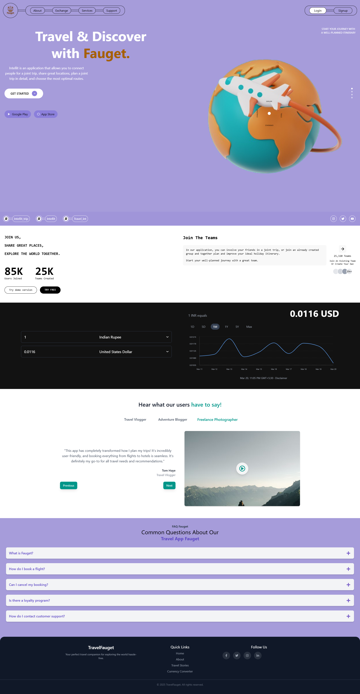
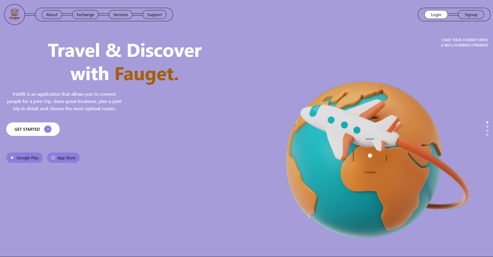
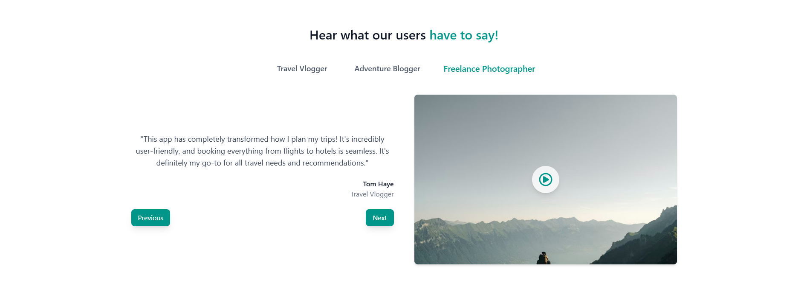
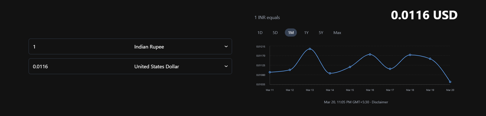
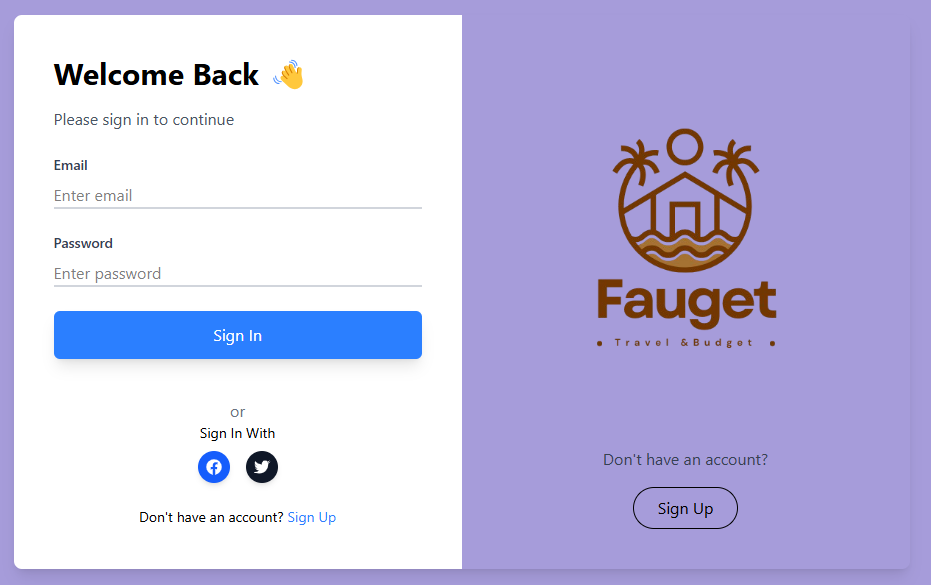

# 🌍 TravelFauget - Your Ultimate Travel Companion 🚀



TravelFauget is a modern travel planning application designed to help travelers explore new destinations, manage bookings, and access currency conversion effortlessly.

🔗 **Live Demo:** [TravelFauget]()  

---

## 📌 Features

✅ **User Authentication** (Sign Up / Sign In)  
✅ **Currency Converter** (For hassle-free travel expenses)  
✅ **Travel Stories** (Read inspiring experiences from travelers)  
✅ **Responsive UI** (Optimized for mobile & desktop)  
✅ **Dark Mode Support** (Coming Soon)  

---

## 🚀 Tech Stack

| Frontend | Backend | Other |
|----------|---------|-------|
| React.js | Node.js | Tailwind CSS |
| React Router | Express.js | Cureency Exchange |
| React Icons | MongoDB |  |

---

## 📸 Screenshots

### 🏠 Home Page


### ✈️ Travel Stories Page


### 🔄 Currency Converter


### 🔄 Auth Page


---

## 🛠️ Installation & Setup

1️⃣ **Clone the Repository**  
```bash
git clone https://github.com/utkarsh032/B43_WEB_216_Web-Project-211
cd B43_WEB_216_Web-Project-211
